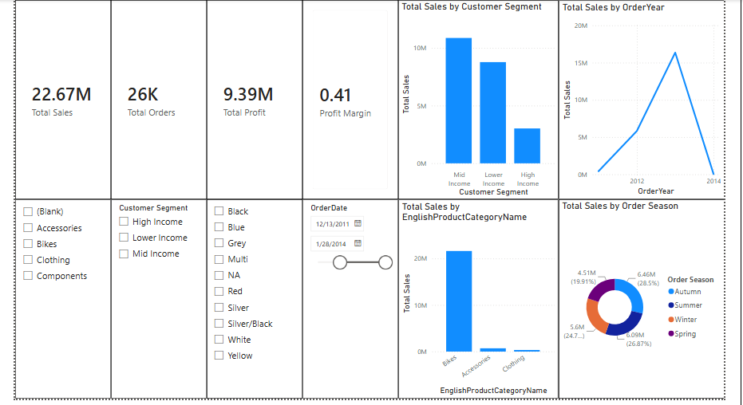

# FlowMetrics

End-to-end sales reporting pipeline: SQL Server, Python, Power BI.

## Overview
A staged reporting pipeline built on the AdventureWorksDW2022 data warehouse. Raw internet sales data is extracted from SQL Server, cleaned and enriched in Python, loaded back into a dedicated reporting table, and visualized in an interactive Power BI dashboard. Automating the cleaning and transformation steps reduces repetitive manual work and supports a more efficient reporting workflow.

## Pipeline
1. **Extract:** read `FactInternetSales` from SQL Server into a Pandas DataFrame.
2. **Transform:** run data quality checks (missing values, duplicates, data types, invalid values), clean the data, and rename columns.
3. **Feature engineering:** add Profit, Discount Percentage, Order Year/Month/Quarter, Sales Category, and other reporting features.
4. **Load:** write the result to a new SQL Server table, `PythonSalesReportingTable`.
5. **Report:** connect Power BI to the reporting table and the required dimension tables in a star schema.

## Power BI Report
- **Data model:** star schema with the reporting table and dimension tables
- **DAX measures:** Total Sales, Total Profit, Total Orders, Average Order Value, Total Quantity, Profit Margin
- **Calculated columns:** Profit Category, Sales Size, Order Season, Customer Segment
- **Dashboard:** KPI cards, charts, and slicers to explore sales by period, product category, territory, and customer segment
- **Drill-through page:** detailed view for a selected entity

## Tech Stack
- SQL Server (SSMS), AdventureWorksDW2022
- Python (pandas, SQLAlchemy)
- Power BI Desktop (DAX)

## Project Structure
- `sql/` - SQL scripts
- `python/` - Python ETL script
- `powerbi/` - Power BI report (.pbix)
- `images/` - dashboard screenshots

## Dashboard Preview

## How to Run
1. Restore the AdventureWorksDW2022 database in SQL Server.
2. Install dependencies: `pip install pandas sqlalchemy pyodbc`
3. Run the script in `python/` to create `PythonSalesReportingTable`.
4. Open the `.pbix` file in Power BI Desktop and refresh the data.
